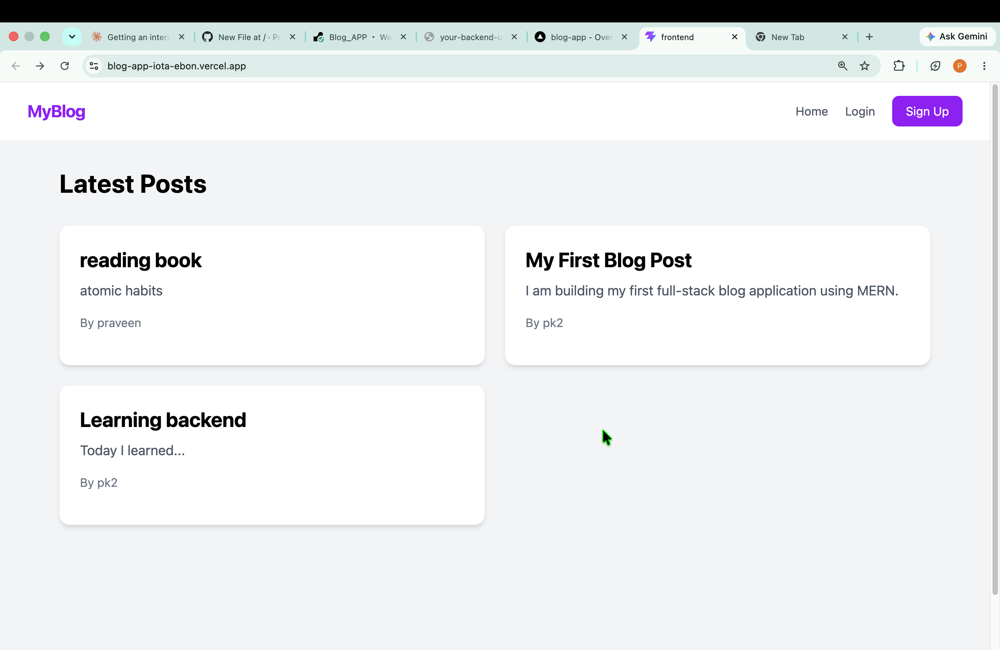
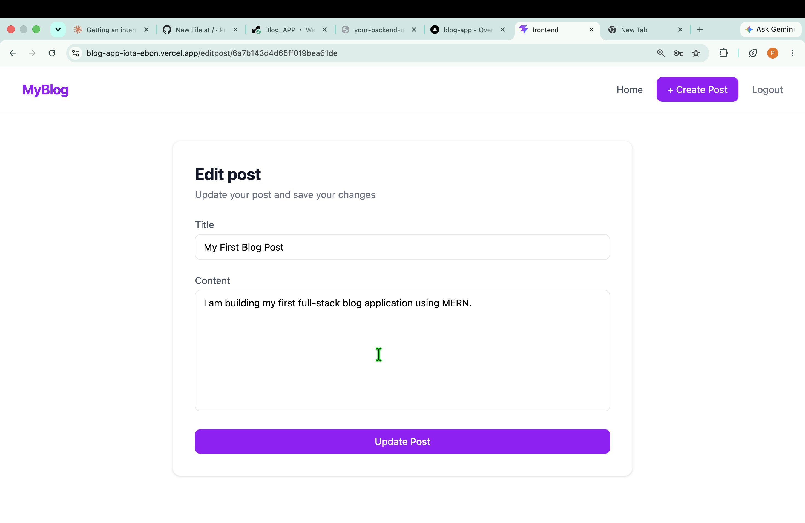
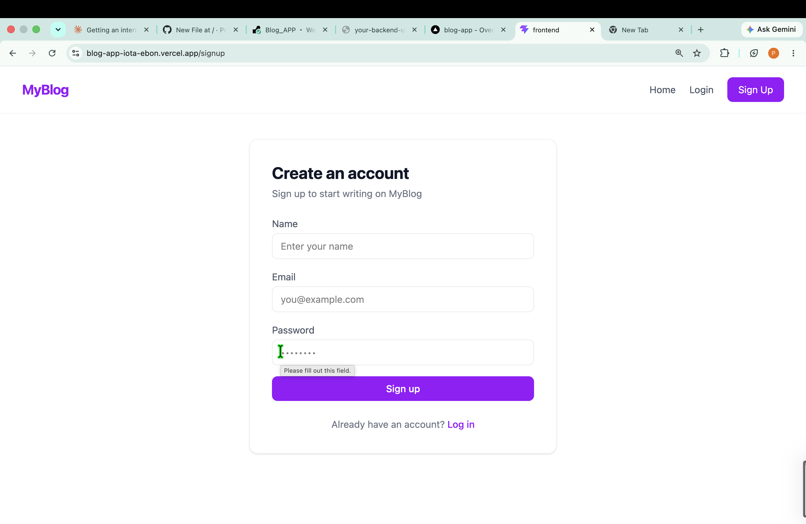

# 📝 MyBlog — Full-Stack Blog App

A full-stack blog platform built with the MERN stack, featuring JWT-based authentication and complete CRUD functionality for blog posts.

🔗 **Live Demo:** https://blog-app-iota-ebon.vercel.app  


> Note: Backend is hosted on Render's free tier — the first request after inactivity may take 30-50 seconds to respond while the server wakes up.

## Features

- 🔐 User signup & login with JWT authentication and bcrypt password hashing
- ✍️ Create, read, update, and delete blog posts
- 🔒 Ownership-based authorization — only the author can edit or delete their own posts
- 📱 Fully responsive UI built with React and Tailwind CSS
- ⚡ RESTful API architecture with protected routes

## Tech Stack

**Frontend:** React, React Router, Axios, Tailwind CSS  
**Backend:** Node.js, Express.js  
**Database:** MongoDB, Mongoose  
**Authentication:** JWT (JSON Web Tokens), bcrypt.js  
**Deployment:** Vercel (frontend), Render (backend), MongoDB Atlas (database)

## Screenshots





## Run Locally

Clone the repo:
```bash
git clone https://github.com/Praveenkushwaha181/Blog_APP.git
cd Blog_APP
```

**Backend setup:**
```bash
cd backend
npm install
```
Create a `.env` file in `backend/` with:
MONGO_URI=your_mongodb_connection_string
JWT_SECRET=your_secret_key
Run the server:
```bash
npm run dev
```

**Frontend setup:**
```bash
cd frontend
npm install
npm run dev
```

## API Endpoints

| Method | Endpoint | Access | Description |
|--------|----------|--------|-------------|
| POST | `/api/auth/signup` | Public | Register a new user |
| POST | `/api/auth/login` | Public | Log in a user |
| GET | `/api/posts` | Public | Get all posts |
| GET | `/api/posts/:id` | Public | Get a single post |
| POST | `/api/posts` | Protected | Create a new post |
| PUT | `/api/posts/:id` | Protected (owner only) | Update a post |
| DELETE | `/api/posts/:id` | Protected (owner only) | Delete a post |

## Author

**Praveen Kumar Kushwaha**  
[LinkedIn](https://www.linkedin.com/in/praveen-kushwaha-260101334) · [GitHub](https://github.com/Praveenkushwaha181)
